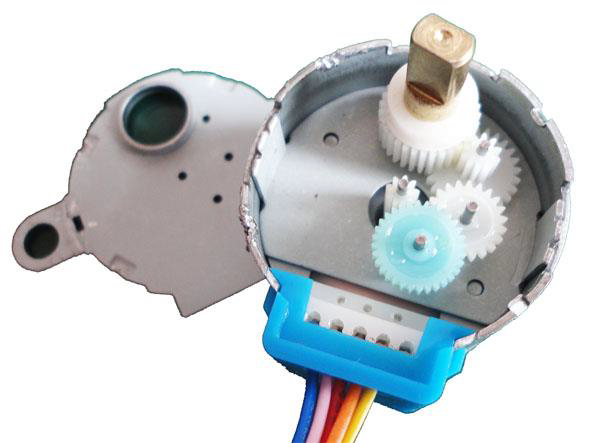
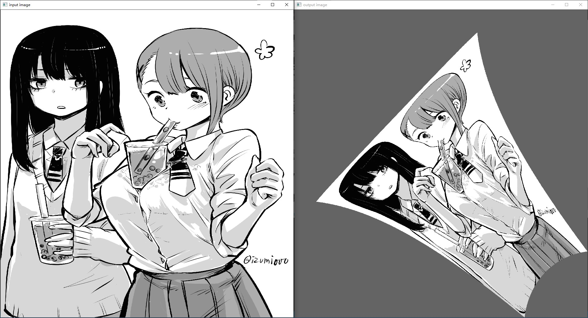
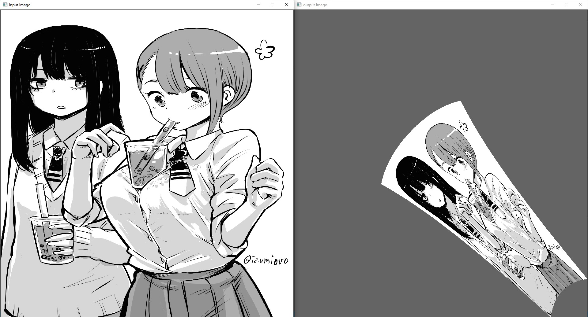
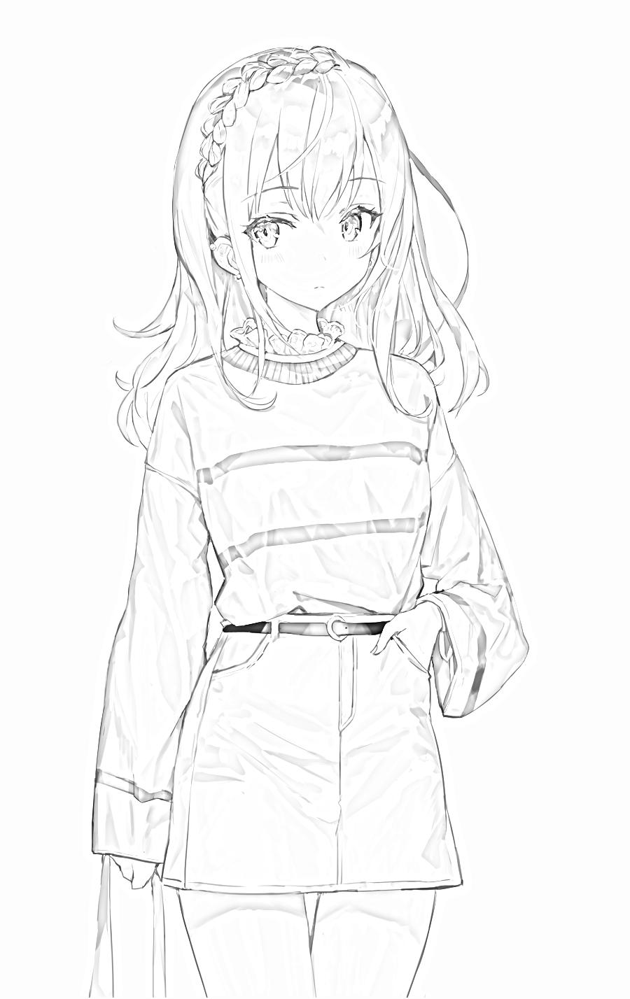
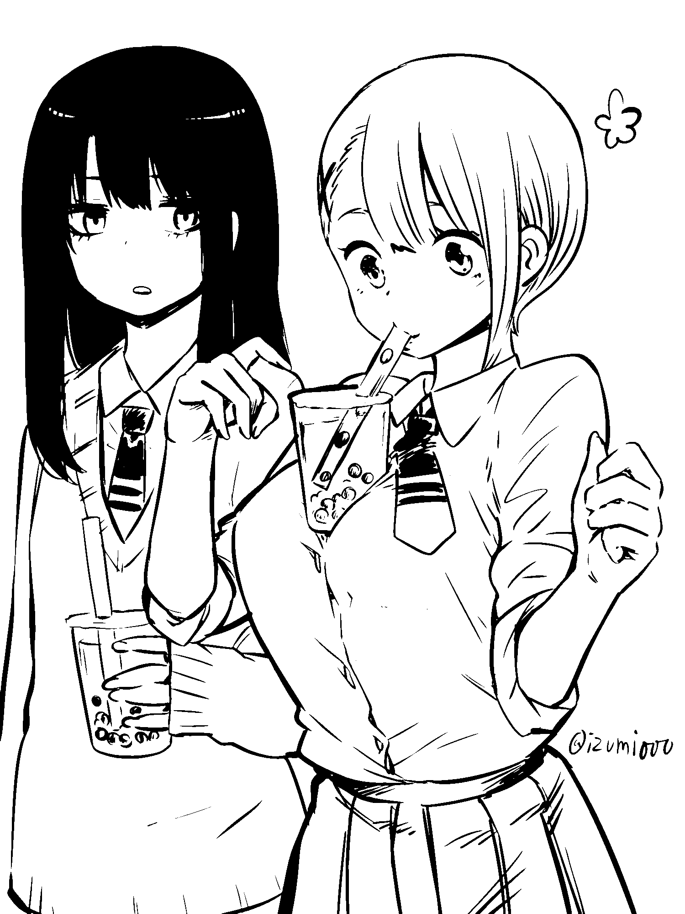
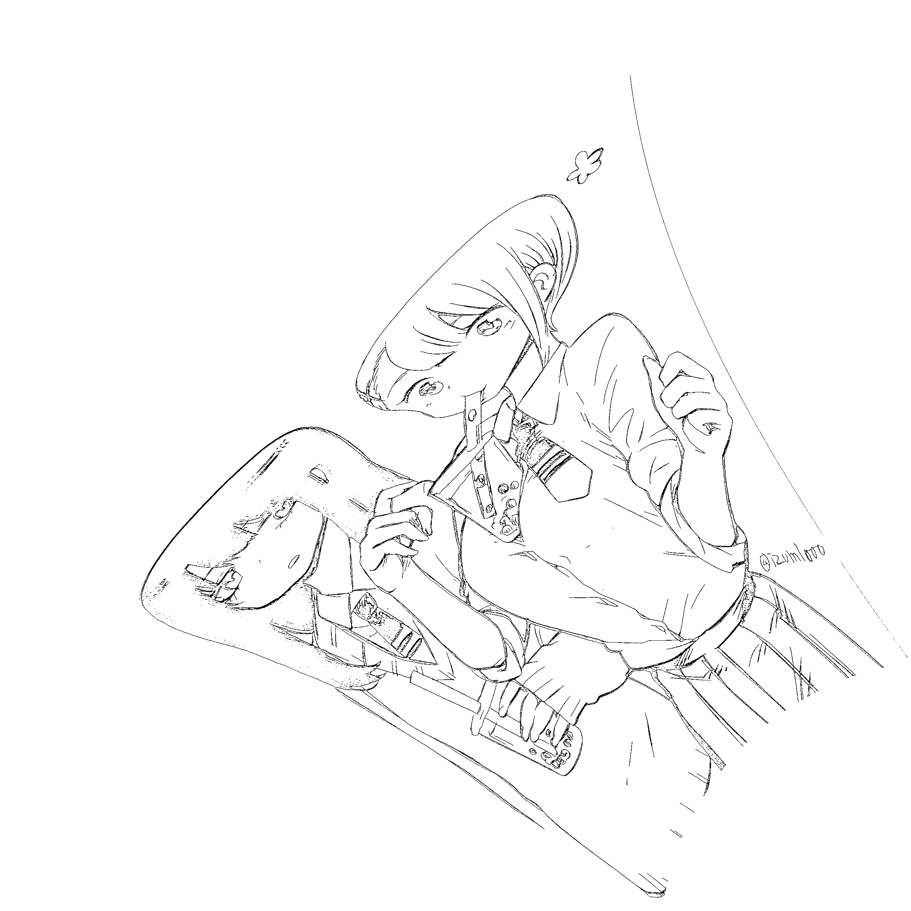

# 图像预处理 ImagePreprocess

对待显示的图像/文字进行预处理，得到适合写字机器人的双极坐标下的二值位图（点阵图）。除了进行坐标变换外，还需要对图像进行一系列处理，以获得更好的显示效果。

处理工序：（名字是我随便起的）

* 像素二值化
* 图像素描化
* 线条归一化
* 上采样/下采样
* 分辨率对齐（坐标变换）

注：工序的顺序有待后续进一步实验。

## 分辨率

对输入的源图像，及输出的位图的分辨率的讨论。

### 液晶板的分辨率

液晶小黑板上的笔记会随写字的力度变化，大概在 0.4~1.5mm 之间。一般的纸和笔则是在0.4~0.7mm 之间。而

* 10英寸米家小黑板的可写面积大概是：150×200mm，也就是说，分辨率最高为 375×500，最低为 100×133
* 淘宝上9.9包邮的8.5英寸小黑板的可写面积为 120×174mm，对应的最高分辨率为 300×435，最低为 80×116

实验时，我们使用8.5英寸的小黑板，并取笔记粗细为 0.6（方便计算），则分辨率为 200×290. 要清晰显示一个汉字，至少要 16×16（不考虑[丁卯点阵体](https://3type.cn/fonts/dinkie_bitmap/index.html)），这么一来，我们一共能显示 12×16=192字，用作备忘录应该可以了（用作情书得增加分辨率才行）。

### 步进电机分辨率

但除了液晶小黑板的分辨率外，我们还要考虑笔的最小移动距离，即步进电机的最小转动距离。

28BYJ-48 是四相八拍减速型步进电机，转子转动一圈需要 64 拍，而减速比为 1:64，从而转轴转一圈需要 4096 拍。（参考自 [太极创客 - 28BYJ-48单极性步进电机](http://www.taichi-maker.com/homepage/reference-index/motor-reference-index/28byj-48-stepper-motor-intro/)）

由于转轴不是圆的，所以需要在外部套上轴套（3D打印），设轴套直径为 5mm，考虑上线缠绕会增加 1mm 左右，也就是总共 6mm。那么，最小转动距离为 π×6÷4096 ≈ 0.0046mm

只有当线垂直时，笔的最小移动距离才等于最小转动距离，当不垂直时，情况会比较复杂，有可能大于也有可能小于最小转动距离（见下图红框的下部，纵向小于，横向大于）

由于最小移动距离并不是唯一的，为了避免误解，我们使用“格点距离”来表示笔的移动距离。格点距离 $d$ 可以用如下公式计算：设 P 点的双极坐标为 $(a_p,b_p)$，Q 点的双极坐标为 $(a_q,b_q)$，极点间距为 $w$，则根据余弦公式：

$$
\sec \left( \arccos\left(\frac{a_p^2+w^2-b_p^2}{2a_pw}\right)-\arccos \left( \frac{a_q^2+w^2-b_q^2}{2 a_q w} \right) \right)=\frac{a_p^2+a_q^2-d^2}{2a_p a_q}
$$

我们可以利用反三角函数公式化简：

$$
记\, x=\frac{a_p^2+w^2-b_p^2}{2a_pw}, y=\frac{a_q^2+w^2-b_q^2}{2 a_q w}\\
则\, xy+\sqrt{(1-x^2)(1-y^2)}=\frac{a_p^2+a_q^2-d^2}{2a_p a_q}
$$

继续化简：

$$
\begin{aligned}
    d^2=&a_p^2+a_q^2 - 2 a_pa_q\left(xy+\sqrt{(1-x^2)(1-y^2)}\right)\\
    =&a_p^2+a_q^2 - \frac{(a_p^2+w^2-b_p^2)(a_q^2+w^2-b_q^2)}{2 w^2}\\
    &\frac{1}{2w}\sqrt{(2a_p w)^2 - (a_p^2+w^2-b_p^2)^2 }\sqrt{(2 a_q w)^2 - (a_q^2+w^2-b_q^2)^2}
\end{aligned}
$$

尴尬了，matlab 没装 symbolic math toolbox 求不了导，随便取几组数据吧。取 $w=100$，$\Delta=0.0046$：

|原位置(线长)|移动后|距离|
|-----|-----|---|
|(57.73,57.74)|(+Δ,-Δ)|0.0053|
|(57.73,57.74)|(+Δ,+Δ)|0.0092|
|(186.81,186.82)|(+Δ,-Δ)|0.0172|
|(186.81,186.82)|(+Δ,+Δ)|0.0048|

实际的最小转动距离并不会取这么小，感觉可以乘个 25，故取 $\Delta=0.115$

|原位置(线长)|移动后|距离|
|-----|-----|---|
|(57.73,57.74)|(+Δ,-Δ)|0.1328|
|(57.73,57.74)|(+Δ,+Δ)|0.2293|
|(186.81,186.82)|(+Δ,-Δ)|0.4297|
|(186.81,186.82)|(+Δ,+Δ)|0.1194|

观察上面几组数据，可以得出以下结论：

1. 当笔靠近上面时，横向格点距离与最小转动距离差不多，纵向则是 2 倍关系
2. 当笔靠近下面时，纵向格点距离与最小转动距离差不多，横向则是 4 倍关系
3. 在可写面积内，基本上不会出现格点距离小于最小转动距离的情况，因此可以认为最小格点距离就是最小转动距离。

### 输出位图的分辨率

尽管实际显示的分辨率仅有 200×290（液晶小黑板的分辨率），但输出位图的分辨率应该比这个大。我们可以用下图来说明原因。

图片中的涂红部分为要落笔的像素点，如果要从一个像素移到另一个像素，可以使用多种驱动电机的方式，最简单的有三种：①先左电机后右电机、②先右电机后左电机、③同时驱动。

同步驱动对控制的要求比较高，并且完全同步是不可能的。而另外两种在移动的过程中都会误涂到空白像素，上图中标出的数字就是误涂面积。一种减少误涂面积的方法就是增加分辨率，减小每次移动的距离。

当然，图像的分辨率也不是越大越好，太大的话，后面路径规划的计算时间会很长，并且画图的时间也很长。另外，分辨率的上限也受到最大格点距离（最小转动距离）的影响。~~如果取最小转动距离为 0.115（25拍）：宽 120/0.115=1043，高 174/0.115=1513（大概是 1080P）~~。

输出位图具体的分辨率将在“分辨率对齐”一节再深入讨论。

## 分辨率对齐（坐标变换）

分辨率对齐指的是数字图像映射到实际的纸上，此处的“数字图像”有两个：输入的源图像以及输出的位图。理想的情况是源图像和位图均重合于实际的纸上，不过实际中必然存在一定偏差，我们要尽可能减小偏差。

首先我们需要确定两电机之间、纸于电机之间的距离。

两电机无论是直接粘在墙上，还是先粘在框架上，它们之间的距离大概能精确至 1mm。假设这个距离是 $w$. 同时，我们假设两电机在一条水平线上（误差 $\pm 1^\circ$），这样，我们就能在空间中建立双极坐标系和直角坐标系（以坐电机为原点）。

我们又假设纸是正的（误差 $\pm 1^\circ$），左上、右上、右下、左下角用 $P_1,P_2,P_3,P_4$ 表示。设纸的左上角 $P_1$ 点的直角坐标为 $(x_1,y_1)$，纸的宽度为 $w_p$，高度为 $h_p$（同样精确到 1mm）。

设源图像的分辨率为 $w_i \times h_i$，并且图像尽可能铺满纸。那么，纸上的每个点 $(x,y) \in \mathbb{R}^2$ 与像素 $(m,n) \in \mathbb{N}^2$ 满足如下对应关系：

$$
w_g = \min\{ \frac{w_p}{w_i}, \frac{h_p}{h_i} \}\\
\lceil\frac{x-x_1}{w_g}\rceil=m\\
\lceil\frac{y-y_1}{w_g}\rceil=n \tag{1}
$$

这里的像素从左上角开始数起，恰好与 opencv 中一致。$w_g$ 是像素格（grid）的边长。上述就是输入的源图像映射到纸上的过程

然后我们再将位图映射到纸上。不过我们需要先确定位图的分辨率。假设最小转动距离为 $w_r$，线的长度的取值范围为：

$$
a\in[\sqrt{x_1^2+y_1^2},\sqrt{x_3^2+y_3^2}]\\
b\in[\sqrt{(w-x_2)^2+y_2^2},\sqrt{(w-x_4)^2+y_4^2}] \tag{2}
$$

则分辨率为：$\lceil\dfrac{a_\max}{w_r}\rceil\times\lceil\dfrac{b_\max}{w_r}\rceil$，其中每个像素点 $(k,l) \in \mathbb{N}^2$ 与空间中的点 $(x,y) \in \mathbb{R}^2$ 满足如下对应关系：

$$
\frac{(k w_r)^2+w^2-(lw_r)^2}{2w}=x\\ 
\frac{1}{w}\sqrt{(k w_rw)^2-\left(\frac{w^2+(k w_r)^2-(lw_r)^2}{2}\right)^2}=y \tag{3}
$$

把公式 $(3)$ 代入公式 $(1)$ 就能得到不同坐标下的像素对应关系：

$$
m=\lceil\frac{(k w_r)^2+w^2-(lw_r)^2}{2ww_g}-\frac{x_1}{w_g}\rceil\\
n=\lceil \frac{1}{w w_g}\sqrt{(k w_rw)^2-\left(\frac{w^2+(k w_r)^2-(lw_r)^2}{2}\right)^2}-\frac{y_1}{w_g}\rceil
$$

python 程序见 cartesian2bipolar_v1.py，输入 (2000, 1500, 3) 的图片，最小转动距离取 0.0046mm，输出 (2333, 2333, 3) 的图片。经过处理后的图像为（左：输入；右：输出）：

为了对比明显，我将图像外部用灰色来填充（实际中应该为纯白色）。注意到位图右下角好像被“挤压”了，说明这部分的图像清晰度有损失。（这也是这种写字机器人的缺点，图像的清晰度不均匀）

为了减小这部分损失，减小清晰度不均匀，我提出以下几种方案：

### 纸下移方案

尝试修改纸与电机的距离，从上面的 10mm，改为 100mm，得到下图：

注意到顶部和底部的分辨率差距减小了。这种方案的优点是：简单无脑。缺点嘛，就是使得写字机器人的占地变大了。

### 动态转动距离方案

引入“动态转动距离”方案。根据在“步进电机分辨率”一节的实验结论，当 $y$ 较小时（顶部），横向格点距离较大，当 $y$ 较大时（底部），横向格点距离较小。因此我们只需要改变一下位图像素索引与绳长的映射关系。原本的映射关系为：$(k,l)\rightarrow (kw_r,lw_r)$，现在假设映射关系为：$(k,l)\rightarrow (kw_r(y),lw_r(y))$，需要求解函数：$w_r(y)$

这个函数还挺复杂的……为了简单起见，我们规定转动距离取 $[w_{r\min},w_{r\max}]$ 中的整数值，即：

$$
w_r(y_\min)= w_{r\max}\\
w_r(y_\max)= w_{r\min}
$$

同时，观察位图左下的灰白交界线，感觉 $w_r(y)$ 应该是一个 $\ln$ 或 $\sqrt{\quad}$ 函数，假如是 $\ln$ 的话：

$$
w_r(y)= \lceil w_{r\min}+\frac{w_{r\max}-w_{r\min}}{\ln (y_\max-y_\min+1)}\ln (y_\max-y+1) \rceil
$$

假如是 $\sqrt{\quad}$ 的话：

$$
w_r(y)= \lceil w_{r\min}+\frac{w_{r\max}-w_{r\min}}{\sqrt{y_\max-y_\min}}\sqrt {y_\max-y}\rceil
$$

但是要求解 $y$，就必须要知道绳长……因此这种方案被我pass了

### 椭圆坐标方案

> 这个方案有点炫技的意味。

观察格点，我发现底部的曲率较大，这可能是造成底部格点距离较大的原因。因此我想能不能利用椭圆两端曲率较大的特点，减小底部的格点距离。

为此，我们需要对双极坐标进行改造。原本双极坐标的两个坐标变量 $(a,b)=(kw_r,lw_r)$ 表示的是到两个极点的距离，现在要变成椭圆坐标，每个极点需要改成两个焦点，同时，$(a,b)$ 表示为一对焦点间的距离。如果我们定义两个椭圆的表达式为：

$$
\frac{y^2}{a_A^2}+\frac{x^2}{b_A^2}=1\\
\frac{y^2}{a_B^2}+\frac{(x-w)^2}{b_B^2}=1\\
A 指左边的椭圆，B 指右边的椭圆
$$

$a_A,a_B$ 与 $b_A,b_B$ 保持某个比例，定义为 $\frac{a_A}{b_A}=\frac{a_B}{b_B}=\sec \beta$. 另外，$a_A=a$，$a_B=b$，即长轴的一半，这样的话，当 $\sec \beta=1$ 时，这种方案就能退化为之前的方案。

如果 $\sqrt{a_A^2-b_A^2} + \sqrt{a_B^2-b_B^2} \geq w$，则两个椭圆存在交点，交点求解如下：

$$
y^2+\frac{a_A^2 x^2}{b_A^2}=a_A^2\\
y^2+\frac{a_B^2(x-w)^2}{b_B^2}=a_B^2
$$

两式相减，有：

$$
[x^2-(x-w)^2]\cdot \sec^2 \beta = a_A^2-a_B^2
$$

整理后有：

$$
x=\frac{a_A^2-a_B^2}{2w\sec^2 \beta}+\frac{w}{2}
$$

代入回原式有：

$$
y=\sqrt{a_A^2-x^2 \sec^2 \beta}\\
（只取正值）
$$

实际的绳长为：

$$
\begin{cases} 
a'=\sqrt{x^2+y^2}\\ 
b'=\sqrt{(w-x)^2+y^2} 
\end{cases}
$$

另外我们还要计算位图的分辨率。纸的四个角还是用 $P_1,P_2,P_3,P_4$（左上、右上、右下、左下）表示，对应坐标为 $(x_1,y_1)$……，则 $a,b$ 的取值范围为：

$$
a\in \left[\sec \beta \sqrt{\frac{y_1^2}{\sec^2 \beta}+x_1^2}, \sec \beta \sqrt{\frac{y_1^3}{\sec^2 \beta}+x_1^3} \right]\\
b\in \left[\sec \beta \sqrt{\frac{y_2^2}{\sec^2 \beta}+x_2^2}, \sec \beta \sqrt{\frac{y_4^3}{\sec^2 \beta}+x_4^3} \right]
$$

下面是这种方案的验证结果，$\sec \beta$ 取 $1.2$（程序见 cartesian2bipolar_v2.py）

|方案|结果|分辨率|有效像素点（图像区域）|
|---|----|----|----|
|无改进方案||2333x2333|1 919 475|
|纸下移方案||2985x2985|1 705 659|
|椭圆坐标方案||2524x2524|2 337 640|

我把几种方案放在一张表格中以方便对比。评价标准如下：

1. 左上角和右下角两条分界线是否等长，长度约接近则效果越好
2. 转换后的图像的比例与原图像越接近越好
3. 有效像素越多说明越精细

从评价标准 1 来看，椭圆>纸下移>无改进。我们原图像的长宽比为 4:3，从评价标准 2 来看，椭圆>纸下移>无改进。从评价标准 3 来看，椭圆>无改进>纸下移。综合来看，椭圆完胜。

当然，从计算角度来说，椭圆坐标最复杂，不过一般都是在电脑上做，处理时间应该差不多。

## 上采样/下采样

现在看来，在坐标变换的过程中已经完成了上采样与下采样。当然，我们依然可以利用深度学习来补充细节，比如 [Bigjpg - AI人工智能图片放大](https://bigjpg.com/) 和 [waifu2x](http://waifu2x.udp.jp/index.zh-CN.html)，这不是本项目的关注点，故不细说。

## 图像素描化

我还没学图像处理，就随便从网上找了一些程序，经过实验后，比较好的是这个：[Python3 用PIL处理图像（二）——将图片装换成素描](https://my.oschina.net/u/4303818/blog/4254663)，代码在 PIL_sketch.py 经过处理的图像如下：

如果是彩色图片，效果是这样的：

|原图|素描化|
|--|------|
|||

## 图像二值化

用 [CodecWang - Opencv-Python Tutorial](http://codec.wang/#/opencv/start/06-image-thresholding) 上的代码对原图像（未经素描化）进行处理，代码在 adaptive.py 和 otsu.py，得到下面几种结果：

对素描化的图像进行处理，得到下面几种结果：

另外，还有使用 Otsu 方法：

好像……都差不多？主要区别就是头发和衣服，另外，经过素描化再二值化反而效果不好。算了，不管这么多了，反正都作为选项，由用户自行选择。

## 图像线条正则化（归一化）

参考了：[线稿处理LineCloser及LineNormalizer](https://zhuanlan.zhihu.com/p/44447467)

线条正则化就是统一粗细，这样就不用反复涂了。另外，在正则化前，还需要进行线条闭合化，将线的缺口补回去。这需要利用深度学习来完成，我是在 colab 上弄的。

我选取了 gaussian+otsu 处理后的图片，经过 LineCloser处理后，有：

|原图|对比|LineCloser处理后|
|---|---|---------------|
||||

然后进一步用 LineNormalizer 处理，处理完后图像部分变成灰色，需要重新用otsu处理

|LineCloser处理后|对比|LineCloser+LineNormalizer+otsu处理后|
|---------------|-----|--------------|
||||

经过一系列处理后，将粗线用一条或两条细线代替，可以提高写字机器人的效率。但是要注意的是，LineNormalizer 最好在坐标变换后再做，因为坐标变换会导致某些线变得破碎（见下面对照）

|lineNormalizer+c2o|c2o+lineNormalizer|
|------------------|------------------|
|||

## 碎线移除

太短的线没必要画出来，影响效率，还让画面变得很乱，因此需要去除这些碎线。代码在 shortRemove.py，对LineCloser+LineNormalizer+otsu处理后的图像进行碎线移除，效果如下：

# 处理顺序

素描化 ==> 二值化 ==> LineCloser ==> 碎线移除 ==> c2o ==> LineNormalizer 